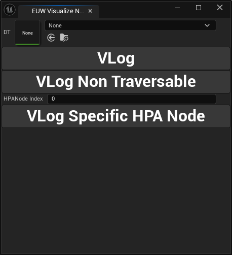

# Flying AI Plugin

Flying AI Plugin is a modular plugin for Unreal Engine 5.3 and 5.5, providing behavior tree and blueprint nodes for AI development.

## Table of contents

* [Introduction](#introduction)
* [Installation](#installation)
* [Quick start](#quick-start)
* [Usage](#usage)
* [Known issues and limitations](#known-issues-and-limitations)
* [Acknowledgments](#acknowledgments)

## Introduction

The plugin is designed to be used mostly for AI development with `Behavior Tree`, which provides pathfinding and location query for flying AI. Blueprint nodes and C++ functions are also provided for development outside of Behavior Tree. Custom pathfinding algorithm can be used as you like.


## Installation

To install the Flying AI Plugin, follow these steps:

1. Copy the plugin including the plugin folder into the `ProjectRootDirectory/Plugins`. If `/Plugins` does not exist, create it.
2. Open your project.
3. Enable the plugin in Editor.


## Quick start

In `Project Settings`, under Plugin you will find Flying AI Plugin sessions. Inside that, add map to map settings to enable the system in that map. Select `UseLocationQuery` to enable Location query. 

Go to `Plugins/FlyingAIPlugin/FlyingAIPlugin Content/Blueprints/` in **Content Browser**. 
> If you cannot see the directory, go to Settings in Content Browser, toggle `Show Plugin Content`.

Place `BP_FABound` in your desire level. Adjust the size of the bound by changing the value in it's Box component.

Right click `EUW_NodeGeneration` in the same folder and click `Run Editor Utility Widget`. You should see this:

Click `...` to select the directory where you want the pathfinding data to be stored. Set the second field to the Bound in the previous step. Press the Generate button. It should takes a few seconds and you will see several save happening. You will see something like `Generation Finished: 0h 0Mins 4` in the Output Log when the generation is finish. Set the generated Data asset to the bound in the level and you are good to go.

In your behavior tree, search for `fly to`. 


Set the blackboard key to a Vector key, set the `Default Land Movement Mode` in the character movement component in your AI.

Run Your Game. Your AI should now flying towards the location of that blackboard key. Note that if the location or the AI is not inside the bound, or the location is inside a collider, the AI won't move at all.


## Usage

### Behavior Tree Node: Fly To


`Collider Size Key`: The collider size of the AI. Needs to be Vector. The default value is (0, 0, 0). If this is not set, your AI will have a higher chance of being stuck.

`Blackboard Key`: The location to fly to.

> [!IMPORTANT]
> Do not change `Require Navigible End Location`. It is there because of inheritance, that will stops the node from working properly.

### Behavior Tree Node: Location Query


`Collider Size Key`: The collider size of the AI. Needs to be Vector. The default value is (0, 0, 0). If this is not set, your AI will have a higher chance of being stuck.

`Blackboard Key`: Output key. Needs to be Vector.


### Blueprint Node: Bound

`Set LOD`: It will set the LOD of the Bound. 

0. Nodes data will be loaded immediately. 
1. Nodes will be loaded asynchronously.
2. Nodes will be unloaded. Location query will not get position from this Bound and path will not be generated for start location and end location within this bound. However, HPA Path that pass this bound will be generated and not for the final path, so be aware that path that generated that pass this bound will be stuck. AI will be waiting for the bound to be loaded.

### Pathfinding Algorithm: 

To use your own pathfinding algorithm, override the ```UFAPathfindingAlgo``` class and set `PathfindingAlgorithmToUse` to your custom class in Project Settings.

### EUW Visualize Node



To visualize the generated Pathfind Nodes. Choose data table and start Visual Logging.


## Known issues and limitations

If the HPA* path is narrowly connected, which the AI is too large to pass through, the system will not be able to find a path and stop moving. It can be fixed by generating multiple HPA* graph for different predefined sizes.

There are currently no avoidance algorithm implemented and therefore AIs may collide with each other.

The plugin does not support 5.4 due to a bug of the built-in Move To.

## Acknowledgments

* [READMINE](https://github.com/mhucka/readmine)
* [Pathfinding in Games](https://doi.org/10.4230/DFU.Vol6.12191.21)
* [Genshin Impact: Building a Scalable AI System](https://gdcvault.com/play/1027347/-Genshin-Impact-Building-a)
* [A Systematic Literature Review of A* Pathfinding](https://doi.org/10.1016/j.procs.2021.01.034)
* [A Guide to adding 3D Pathfinding to Games | Mercuna](https://mercuna.com/3d-navigation-background/)
* [Multithreading and Performance in Unreal](https://forums.unrealengine.com/t/multithreading-and-performance-in-unreal/1216417)
* [Getting off the NavMesh: Navigating in Fully 3D Environments](https://www.gdcvault.com/play/1022016/Getting-off-the-NavMesh-Navigating)
* [Unreal Engine - Programming Subsystems](https://tech.flying-rat.studio/post/ue-subsystems.html)
* [AI Navigation in C++, Customize Path Following Every Tick](https://nerivec.github.io/old-ue4-wiki/pages/ai-navigation-in-c-customize-path-following-every-tick.html)
* [How to add custom settings in Project Settings?](https://forums.unrealengine.com/t/how-to-add-custom-settings-in-project-settings/146330/3)
* [Best practices for naming assets in Unreal Engine](https://unrealdirective.com/resources/asset-naming-conventions)
